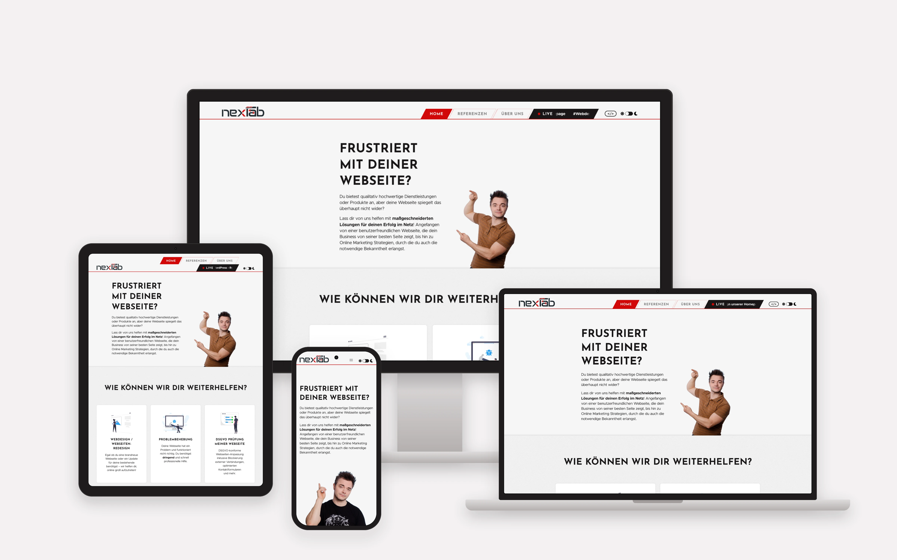
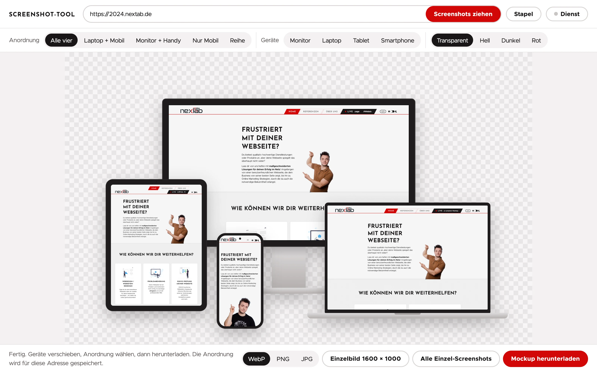

# Screenshot-Tool

**Responsive device mockups of any website, straight from your browser.** Enter a URL, see it on a monitor, laptop, tablet, and smartphone, arrange the devices, and download a 4800 × 3000 px mockup. No build step, no backend, no dependencies.



Built by [nexTab](https://nextab.de) for client presentations and case studies. The interface is in German. This README names the buttons as they appear on screen and explains them in English.

## Features

- **Four devices, one click.** Monitor, laptop, tablet, and smartphone, each captured at its own viewport and pixel density.
- **Live capture for pages behind a login.** Mirror any browser tab into a device and freeze it when it looks right.
- **Bring your own screenshots.** Drag and drop, pick a file, or paste from the clipboard.
- **Free layout.** Start from one of five presets, then move, resize, and restack the devices, or turn tablet and phone to landscape. The layout is remembered per website.
- **Flexible export.** The full mockup, a single 1600 × 1000 px image, or all raw screenshots, as WebP, PNG, or JPG, on a transparent, light, dark, or red background.
- **Batch mode.** A list of URLs goes in, one ZIP comes out, with a folder per site.
- **Swappable frames.** Ships with neutral device frames. Drop in your own set without changing any code.
- **Runs anywhere.** Open `index.html` from disk, or host the folder as an installable web app that works offline.
- **Zero dependencies.** One plain JavaScript file of roughly 450 lines, ZIP writer included.



## Quick start

1. Download or clone this repository and open `index.html` in Chrome.
2. Type a web address and click **Screenshots ziehen** ("grab screenshots").
3. Arrange the devices and click **Mockup herunterladen** ("download mockup").

That's it. Nothing to install and nothing to configure.

## Three ways to fill the devices

### 1. From a URL

Type an address and click **Screenshots ziehen**. The tool requests one screenshot per visible device from [Microlink](https://microlink.io), each at that device's viewport size and pixel ratio.

- The page has to be publicly reachable. A screenshot service can't log in for you.
- Microlink's free tier is rate-limited per IP address: 25 requests per day at the time of writing, which is six websites with all four devices.
- If the service can't load a page, the tool says so ("leeres Bild", empty image) instead of quietly inserting a blank screenshot.

### 2. Live capture

For pages behind a login, for a local development server, and for anything a screenshot service can't reach. Live capture needs Chrome or Edge. A single window and a single screen share serve all devices, one after the other:

1. Click a device, then **Fenster öffnen** ("open window"). The address from the URL field opens in a separate window sized for that device. Navigate and log in there.
2. Click **Live verbinden** ("connect live") and pick that window under *Chrome Tab* in the browser's sharing dialog. The device now mirrors the tab in real time.
3. When the view is right, click **Einfrieren** ("freeze"). The device keeps the image and the share keeps running in the background.
4. Click the next device and choose **Live anzeigen** ("show live"). There is no second sharing dialog. Resize the window to suit the device, then freeze again.

Good to know:

- A device that is still live when you download is exported with its current frame.
- You can share any tab, not only the window the tool opened.
- The capture window has no editable address bar. To load a different page, enter the address in the tool and click **Fenster öffnen** again. It loads in the same window.
- If a device is larger than your screen, the window opens scaled down in the same aspect ratio. Zoom out inside the window to get the full device width.

### 3. Your own screenshots

- Drag an image file onto a device,
- click a device and choose **Eigener Screenshot** ("own screenshot"), or
- paste an image from the clipboard (⌘V / Ctrl+V). It lands on the selected device or, with nothing selected, on the next empty one.

Images are fitted to the width of the device's screen and cropped at the bottom, so any screenshot at least as tall as the screen works.

## Arrange

| Control | What it does |
|---|---|
| **Anordnung** (layout) | Five presets: *Alle vier* (all four), *Laptop + Mobil*, *Monitor + Handy* (monitor + phone), *Nur Mobil* (mobile only), *Reihe* (row) |
| **Geräte** (devices) | Show or hide individual devices |
| *Transparent / Hell / Dunkel / Rot* | Background: transparent, light, dark, or red |
| Drag a device | Move it. The arrow keys nudge the focused device. |
| **Größe** (size) | Resize the selected device |
| **Hochformat / Querformat** | Portrait or landscape, for tablet and smartphone |
| **Nach vorne** | Bring the selected device to the front |

The layout is stored per hostname in your browser, so a site you come back to looks the way you left it.

## Export

| Button | Result |
|---|---|
| **Mockup herunterladen** | The arranged mockup at 4800 × 3000 px |
| **Einzelbild 1600 × 1000** | The laptop screenshot (or the monitor's, if there is none) at 1600 × 1000 px |
| **Alle Einzel-Screenshots** | Every raw screenshot at its original resolution |

Choose **WebP** (the default), **PNG**, or **JPG** next to the buttons. JPG has no transparency, so a transparent background becomes white.

## Batch mode

Click **Stapel** ("batch") and enter one address per line. For every address the tool produces the screenshots of all visible devices, the 1600 × 1000 px image, and the mockup, then packs everything into a single ZIP with one folder per site.

- A layout you saved for a site is reused. Every other site gets the current layout.
- Pages that failed are listed in `fehler.txt` inside the ZIP.
- Batch mode uses the screenshot service, so the daily quota applies.

## Devices

| Device | Viewport | Pixel ratio | Orientation |
|---|---|---|---|
| Monitor | 1920 × 1080 | 1× | Landscape |
| Laptop | 1512 × 982 | 2× | Landscape |
| Tablet | 1032 × 1376 | 2× | Portrait or landscape |
| Smartphone | 402 × 874 | 3× | Portrait or landscape |

## Running it

**From disk.** Open `index.html`. Browsers refuse to export a canvas that contains images loaded from the local file system, so the device frames are also shipped as data URIs in `frames.js`. That file is only loaded when the tool runs from `file://`.

**Hosted.** Put the folder on any static web host with HTTPS. In Chrome and Edge the address bar then offers to install it as an app, and a service worker keeps it available offline. Capturing from a URL still needs an internet connection.

## Optional: your own screenshot service

The **Dienst** ("service") dialog takes the base URL and token of a [browserless](https://github.com/browserless/browserless) instance. The tool then sends its requests to `<url>/screenshot?token=<token>` instead of Microlink.

- There is no daily quota other than what your server can handle.
- Common cookie banners are hidden with injected CSS before the screenshot is taken.
- The service has to allow cross-origin requests from wherever the tool runs.

## Using your own device frames

The frames in `img/` are simple, neutral drawings made for this project. You can swap in any other set without touching the code:

1. Create a folder `frames-custom/` next to `index.html` and put six PNGs with a transparent screen into it, named and sized like the built-in ones:

   | File | Size | Screen area (left, top – right, bottom) |
   |---|---|---|
   | `monitor.png` | 1800 × 1387 | 47, 47 – 1753, 1007 |
   | `laptop.png` | 1800 × 1184 | 195, 134 – 1605, 1050 |
   | `tablet.png` | 1380 × 1800 | 71, 74 – 1309, 1726 |
   | `tablet-quer.png` | 1800 × 1380 | 74, 71 – 1726, 1309 |
   | `phone.png` | 880 × 1800 | 47, 45 – 833, 1755 |
   | `phone-quer.png` | 1800 × 880 | 45, 47 – 1755, 833 |

2. If you run the tool from disk, also build `frames-custom/frames.js`:

   ```bash
   { printf 'window.NXT_FRAMES={'; for f in frames-custom/*.png; do printf '"%s":"data:image/png;base64,%s",' "$f" "$(base64 -i "$f" | tr -d '\n')"; done; printf '};\n'; } > frames-custom/frames.js
   ```

3. Open `index.html?frames=custom` once. The choice is remembered in your browser, and `index.html?frames=default` switches back.

`frames-custom/` is listed in `.gitignore`, so a private frame set never ends up in the repository. If your frames have a different size or screen area, adjust `DEV` as described in the next section.

A popular source is Apple's [product bezels](https://developer.apple.com/design/resources/#product-bezels). Apple's license terms apply to those files and restrict how they may be used and passed on, which is why they are not part of this repository.

## Adding or changing devices

Devices live in the `DEV` object at the top of `app.js`. A frame is a PNG with a transparent screen:

```js
phone: {
	label: 'Smartphone',
	src: F + 'phone.png', iw: 880, ih: 1800,  // frame image (F is the folder of the active frame set) and its pixel size
	screen: [5.341, 2.5, 94.659, 97.5],       // screen area in % of the frame: left, top, right, bottom
	r: 108,                                   // corner radius of the screen in frame pixels (optional)
	vw: 402, vh: 874, dsf: 3, mobile: true,   // viewport, pixel ratio, mobile emulation
	quer: { src: F + 'phone-quer.png', iw: 1800, ih: 880, screen: [2.5, 5.341, 97.5, 94.659], vw: 874, vh: 402 }, // landscape variant (optional)
},
```

Set `r` only where the corners of a rectangular screenshot would stick out past a rounded frame. After changing anything in `img/`, rebuild `frames.js`:

```bash
{ printf 'window.NXT_FRAMES={'; for f in img/*.png; do printf '"%s":"data:image/png;base64,%s",' "$f" "$(base64 -i "$f" | tr -d '\n')"; done; printf '};\n'; } > frames.js
```

## How it works

- The preview is plain HTML and CSS. For export, the same layout is redrawn on a canvas at twice the size of the 2400 × 1500 stage.
- URL capture is a request to a screenshot API per device. Nothing is rendered locally.
- Live capture uses the browser's Screen Capture API (`getDisplayMedia`). Freezing copies the current video frame onto a canvas.
- Why not iframes? Many sites forbid embedding (`X-Frame-Options`, `frame-ancestors`), and a page is never allowed to read the pixels of a cross-origin iframe, so nothing could be exported.
- The ZIP file comes from a small built-in writer that stores files without compression, since the images are compressed already.

## Limitations

- The interface is German only.
- Developed and tested in Chrome. Live capture needs a Chromium-based browser.
- URL capture only works for publicly reachable pages and is bound to the service's quota.
- The live capture window is a regular desktop browser window. Responsive layouts follow its width, but a site that decides by user agent still serves its desktop variant.
- The resolution of a live capture depends on the size of the window and the pixel density of your display.

## Privacy

- There is no backend and no tracking. Settings and layouts stay in your browser's local storage.
- URL capture sends the address you enter to Microlink, or to your own service if you configured one.
- Live capture and your own screenshots never leave your browser.

## Project structure

```
index.html              the app
app.js, app.css         logic and styles
frames.js               device frames as data URIs (used on file:// only)
img/                    device frames (PNG with a transparent screen)
frames-custom/          your own frame set (optional, not in the repository)
fonts/                  Metropolis, Josefin Sans
manifest.webmanifest    install metadata
sw.js                   offline cache
icon.svg                app icon
docs/                   images for this README
LICENSE                 MIT License
```

## License

The source code and the device frames in `img/` are released under the [MIT License](LICENSE).

The typefaces in `fonts/` keep their own licenses: Metropolis is published under the Unlicense, Josefin Sans under the SIL Open Font License 1.1.

## Credits

- Typefaces: [Metropolis](https://github.com/dw5/Metropolis) by Chris Simpson (Unlicense) and [Josefin Sans](https://fonts.google.com/specimen/Josefin+Sans) by Santiago Orozco (SIL Open Font License 1.1).
- URL screenshots by [Microlink](https://microlink.io).
- Made by [nexTab](https://nextab.de) in Berlin.
- Built with the help of [Claude Code](https://claude.com/claude-code), Anthropic's coding agent.
